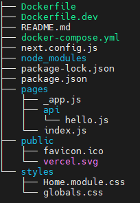
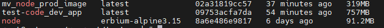

# Project Name
> Master Ventures Devops/SRE Take Home Test

## Table of Contents
* [General Info](#general-information)
* [Technologies Used](#technologies-used)
* [Features](#features)
* [Setup](#setup)
* [Usage](#usage)

## General Information
- The aim of this lab is to build containers with input variables which could be used at build/run time. 
- The codebase used for this test is in NextJS;
- You will not be expected to write any code but it is important to understand how environment variables work in NextJS.

## Technologies Used
- Docker
- Next.js
- npm

## Features
List the ready features here:
- Lightweight pinned version docker node base image used
- Installed node dependencies and run a local development environment
- Installed node dependencies for production
- Removed any redundant files/folders/caches
- Run container as non-root user
- Minimized Docker image to a total size < 400MB

## Setup
- clone git repo.

    `$ git clone https://github.com/ivinsbang/mv-sre-test.git`

    `$ cd mv-sre-test`
    
- Directory tree structure

- Docker images 

## Usage
- Deploy development node image version 1.0.0

`$ cd mv-sre-test`

`$ export NEXT_PUBLIC_APP_VERSION=v1.0.0`

`$ docker-compose up -d`

`$ curl http://localhost:3000/   or http://localhost:3000`

- Deploy Production node image version 1.2.2

`$ cd `

`$ docker build -f Dockerfile  --build-arg NEXT_PUBLIC_APP_VERSION=1.2.2 -t mv_node_prod_image .`

`$ docker run  -d -p 3001:3000 mv_node_prod_image `

`$ curl http://localhost:3001/   or http://localhost:3001`

